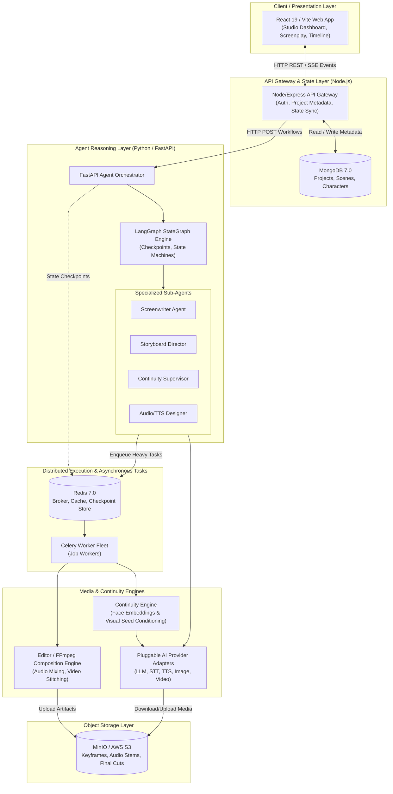
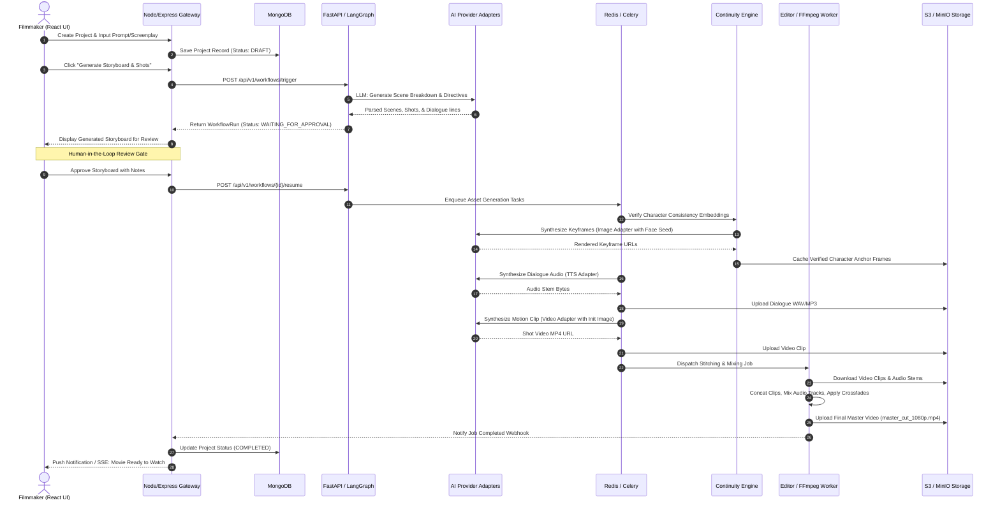
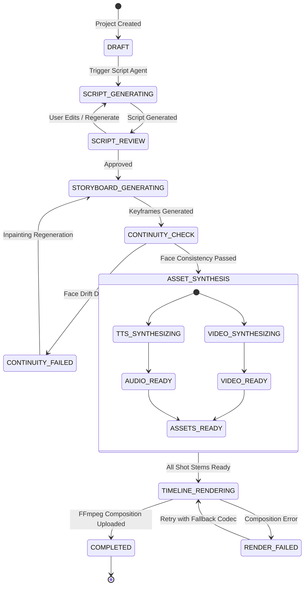

# System Architecture & Technical Specification — Film Studio

**Status**: Baseline Complete (Week 1 Scope Gate)  
**Pipeline**: React → Node/Express → FastAPI/LangGraph → Agents → Redis/Celery → Continuity Engine → Editor/FFmpeg → S3

---

## 1. System Topology Overview

The Film Studio platform utilizes a distributed, decoupled multi-service architecture designed to isolate fast interactive API operations from compute-heavy, non-deterministic generative AI and rendering tasks.



---

## 2. End-to-End Generation Sequence Diagram

This sequence traces the complete path of a project from user prompt to final rendered MP4 in S3.



---

## 3. Scene & Shot State Machine

Each scene and shot follows a deterministic lifecycle:



---

## 4. Storage & Persistence Layout

### 4.1 MongoDB (Documents & Relational Trees)
- `projects`: Metadata, aspect ratio, visual aesthetic style, creator reference.
- `characters`: Character voice profile IDs, prompt conditioning keywords, facial embedding vector references.
- `scenes`: Scene order, screenplay sluglines, narrative descriptions.
- `shots`: Camera prompts, audio dialogue transcript, stem references, duration.

### 4.2 Redis 7.0 (Fast In-Memory & Queues)
- **Celery Broker & Result Backend**: Task queues `generation_queue`, `render_queue`, `priority_queue`.
- **LangGraph Checkpoint Store**: Serialized memory state enabling pause and resume workflows upon human review.
- **Pub/Sub**: Live progress broadcasting to Node gateway WebSocket listeners.

### 4.3 MinIO / Amazon S3 (Binary Media Objects)
```
s3://film-studio-assets/
├── projects/
│   └── {projectId}/
│       ├── characters/
│       │   └── {characterId}/
│       │       ├── reference_seed_01.png
│       │       └── face_embedding.bin
│       ├── scenes/
│       │   └── scene_{sceneNum}/
│       │       ├── shot_{shotNum}_keyframe.png
│       │       ├── shot_{shotNum}_motion.mp4
│       │       └── shot_{shotNum}_dialogue.wav
│       └── exports/
│           ├── timeline_master_{timestamp}.mp4
│           └── storyboard_preview.pdf
```

---

## 5. Failure Recovery, Idempotency & Resiliency

1. **Deterministic Mock Fallback**: In non-GPU environments or when third-party provider rates are exceeded, services gracefully fallback to deterministic mock adapters for local iteration.
2. **Idempotent Celery Tasks**: Every task has a unique task hash composed of `(shot_id, prompt_hash, seed)`. If already present in S3, duplicate generation is skipped.
3. **LangGraph State Checkpointing**: Long-running multi-agent debates and revisions do not lose state upon container restarts.
